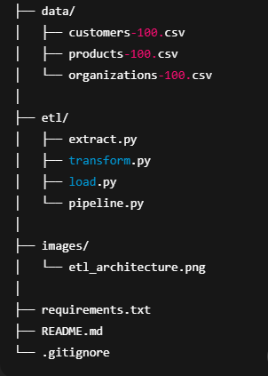

# Python-ETL-Pipeline
Built a Python ETL pipeline to Extract, Transform (clean and merge customer, product, and organization data from multiple CSV sources) and Load into a single analytics-ready dataset.

## Project Overview: Retail Data ETL Pipeline 
This project demonstrates a Python-based ETL pipeline that:
- Extracts data from multiple CSV files
- Cleans and standardizes each dataset
- Merges them into a single analytics-ready dataset
- Outputs one clean CSV file

## Project Description
This project implements a Python-based ETL (Extract, Transform, Load) pipeline designed to integrate data from multiple CSV sources into a single, clean, and analytics-ready dataset.

The pipeline extracts data from three independent sources—Customers, Products, and Organizations—each representing a different business domain. During the transformation phase, the data is cleaned, standardized, and validated to ensure consistency in formatting, data types, and values. This includes normalizing text fields, formatting dates, handling numeric values, and preparing the datasets for reliable integration.

After cleaning, the pipeline merges the datasets using meaningful business keys (such as customer company and organization name) to create a flattened dataset that combines customer details, organizational context, and product attributes into one unified view. The final output is written as a single CSV file, ready for downstream use in analytics, reporting, business intelligence dashboards, or further loading into a database or data warehouse.

The project follows best practices in data engineering, including clear separation of ETL responsibilities into modular components, readable and maintainable code, and comprehensive documentation. It serves as a practical demonstration of how real-world data pipelines are designed, structured, and documented for production.

## Architecture

## Technologies Used
- Python
- Pandas
- CSV Files

## Project Structure

